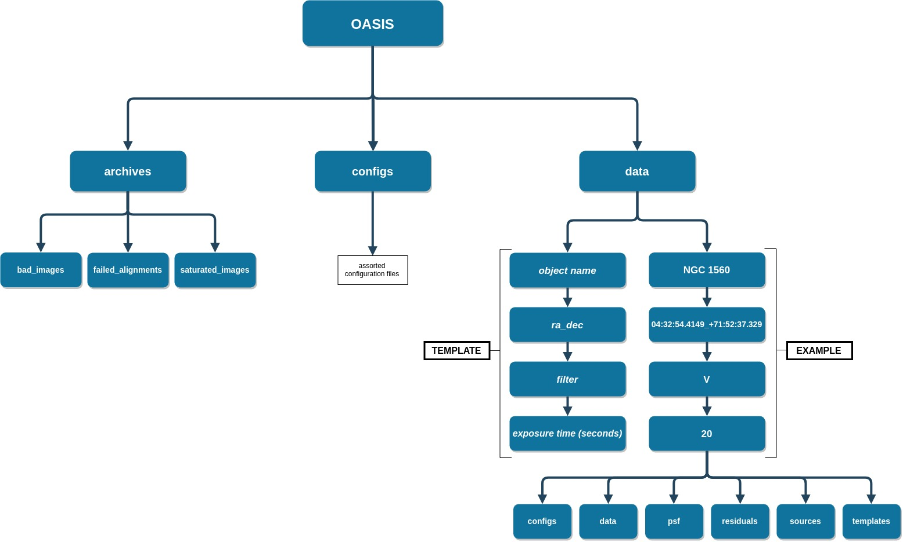
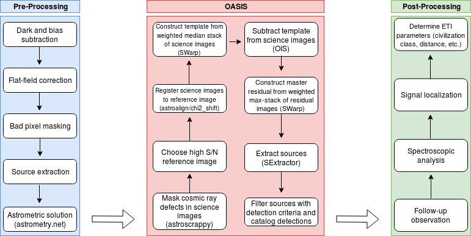

How It Works
============

Here we describe the inner-workings of the **OASIS** engine.

.. note:: This section is dedicated to showing the algorithms and theory behind **OASIS**. For a thorough step-by-step introduction to using **OasisPy** to process real images, see *this Jupyter notebook*.

Overviw of the Software
-----------------------

**OASIS** Environment
^^^^^^^^^^^^^^^^^^^^^

All of the **OASIS** image processing takes place in the **OASIS** environment, a file tree with containers that drive the **OASIS** engine. This set of directories is created automatically during install in the user-specified location, with the root directory being named **OASIS**. Shown below is a schematic of the file tree.

	Click image to enlarge.

.. warning:: Once the **OASIS** file tree is created, DO NOT move or delete any of the three main directories. Manipulating these master directories will result in runtime errors.

The Difference Imaging Process
^^^^^^^^^^^^^^^^^^^^^^^^^^^^^^

Difference imaging is a photometric techinque in which a high signal-to-noise "template" image is subtracted from some real "science" frame to reveal residual sources of flux indicative of variable stars, exoplanet transits, supernovae, etc.

In order to do this successfully, there are a number of image processing steps that need to be done to both the science and template images in order to guarantee an acceptable residual. This is the achille's heel of difference imaging. When the images are prepared correctly, the techinque can be extremely powerful and efficient. When the pre-subtraction steps are done incorrectly, the technique can produce residuals riddled with false sources and messy flux distributions. Thus it is crucial that all steps in the difference imaging process are robust enough to work reliably with any type of astronomical CCD image. This is the main problem **OASIS** has attempted to solve.

The following sections will describe each of the aforementioned steps one must complete in order to difference two astronomical images. Below is a rough schematic of the **OASIS Pipeline** and its execution order.

	Note that your "Pre-Processing" section may be different depending where you get your data from. The example above assumes the user has 	fetched data from the Las Cumbres Observatory online archive (`LCO data archive <https://archive.lco.global/?q=a&RLEVEL=&PROPID=&INSTRUME=&OBJECT=&SITEID=&TELID=&FILTER=&OBSTYPE=&EXPTIME=&BLKUID=&REQNUM=&basename=&start=2019-06-01%2000%3A00&end=2019-11-30%2023%3A59&id=&public=true>`_).

.. note:: 
	A quick word about the language used in the following sections. There are numerous terms that appear often when discussing difference imaging 		who's meaning in this context may differ from the more commonly known definition.
		* **Science image**- All images in the data set. The science images contain the objects being sought.
		* **Template image**- An image made by either stacking numerous science images or choosing a specific science image. This template is subtracted from each science image to look for variable objects.
		* **Residual image**- The resulting image after the :math:`Science - Template` subtraction. The residual is a FITS image with identical dimensions, pixel scale, etc. to the original science images.
		* **Source/Detection**- These terms refer to groups of adjacent pixels of high flux in the residual image that are indicative of some variable or transient object.
		* **Subtraction artifact/false positive**- Detections that are the result of poor difference imaging or defects/noise unaccounted for during the calibration  steps. Minimization of these artifacts is one of the foremost problems in difference imaging.

The **OASIS Pipeline**
----------------------

Acquire Data
^^^^^^^^^^^^

Before getting into the image processing, **OASIS** must first have images to process. **OasisPy** supports two data acquistion methods. The user can manually download their data from some repository and simply tell **OasisPy** where they're located on their local machine, or they can use the built-in ``get`` function to download images from Las Cumbres Observatory's (LCO) data archive. Of course, the second option is only useful if you are a LCO client or have a desire to analyze their publically available images

Masking
^^^^^^^

The first thing **OASIS** does with the input images is mask any problem areas. These include cosmic rays strikes, satellite trails, hot pixels, CCD defects, etc. This is a critical step in any difference imaging analysis as even the smallest artifact or set of bad pixels can inhibit the quality of the residual images.

Many observatories perform some of this masking automatically in their calibration pipelines, on-the-spot as data is taken. They often store these masks as FITS extensions to the original image. Consequently, before masking **OASIS** looks for a "bad pixel mask" (BPM) extension to use as a foundation for the mask building process. If none is found **OASIS** searches for another extension that might contain a mask. If this is unsuccessful the foundation is just a zero mask.

For the masking process **OASIS** makes use of a modified version of the ``astroscrappy`` python package (C. McCully), which itself is based off of the popular LA Cosmic algorithm. Running the ``mask`` method will mask all cosmic rays in each image, as well as saturated stars and other problem objects. Later on, edges created during the registration process are also added to this mask.

.. note:: There are two types of masks **OASIS** uses. The first is the common binary image mask, created during this masking process. In this type each pixel is represented by a 0 or 1, 0 being a good pixel and 1 being a masked one. The second type is what is usually referred to as a "weight-map." Here the elements of the map represent the weight of each pixel. Another way to think about it is as an inverse variance map. The higher a pixel's weight (or inverse variance) the more confident we are in the value of that pixel. Thus, bad pixels will have a low weight (usually 0) and good pixels will have a high weight (usually 1). The weight maps computed by **OASIS** are normalized on the interval [0, 1]. After the initial masking process all image masks are converted to weight maps, as these are more accurate and offer a greater amount of masking control. If you are ever uncertain on what type of mask an image has, just look for the 'WEIGHT' header keyword in the primary FITS header. A value of 'Y' means it's a weight map, a value of 'N' means it's a binary mask.

PSF Modeling
^^^^^^^^^^^^

A critical step in any difference imaging application is being able to model the point-spread functions (PSFs) of the dataset quickly and accurately. **OASIS** does this using the Astromatic program **PSFex** (E. Bertin). The outputted models are then used by **OASIS** for a number of different operations. A preliminary bad image-rejection algorithm uses the PSF FHWM to clip images exceeding a certain threshold. The reference image selection algorithm also uses the FWHM to choose the reference image. The source extraction algorithm uses the overall PSF model to distinguish between stellar sources and galaxies. In the future the PSF model will also be used to optimize the subtraction parameters more efficiently (section **something**).

Running the ``psf`` method will output two files for each image, one *.cat* file and one *.psf* file, both into the **psf** directory. The *.cat* file is the source catalog used by **PSFex** to compute the PSF model. The *.psf* file is the PSF model itself.

Image Rejection
^^^^^^^^^^^^^^^

After masking and PSF modeling **OASIS** searches the dataset for poor quality images that will inhibit the difference imaging process. These usually include images with large defects, focusing issues, extremely poor seeing, low S/N, etc., that could prove toxic, especially to the construction of the template image. This step is completed automatically during the registration step and does not need to be called explicitly. Any bad images found are moved into the **archive** OASIS subdirectory.

Registration
^^^^^^^^^^^^

Before subtracting two images, it is critical to register them to the same astrometric grid (align them), ideally to subpixel precision. To do this **OASIS** employs a two-step registration approach. First, an initial non-subpixel transformation is found with the feature-based python package ``astroalign`` (M. Beroiz). Once the images are aligned using ``astroalign`` the final subpixel registration is completed using the ``image_registration`` (A. Ginsburg) python package, which uses the cross-correlation method to find the horizontal and vertical pixel offsets between the two images.

When registering images, a reference image needs to be chosen to which all other frames will be aligned. This is done automatically by **OASIS** when the ``align`` method is executed. The chosen reference image is the one with the highest S/N. Another option for choosig the reference is that with the best seeing. This option may be included in a later version of **OASIS**.

After the reference frame is chosen and the registration is complete, the last step of the `align` method is to match the intensity scales of each image to the reference image. This step utilizes the **IRAF** routine ``linmatch``. Here flux is preserved as the intensity offsets are assumed to be linear.

.. note:: After each image is registered, its filename will change from *timeofexposure\_N\_.fits* to *timeofexposure\_A\_.fits*. The "U" represents "unaligned" and "A" represents "aligned."

Template Construction
^^^^^^^^^^^^^^^^^^^^^

After the images are all masked and registered to the reference field, they are ready to be combined into a template image. This template image is simply a weighted median stack (according to their weight maps) of the science images images with the best seeing. The default number of images to include in the stack is top 33% with respect to seeing, though this can be changed in the *OASIS.congig* file. The actual stacking is done with the program **SWarp** (E. Bertin). The final template image is outputted to the target's 'templates' directory, along with a log of the past template constructions. This log is titled *log.txt* and is located in the **templates** directory.

Subtraction
^^^^^^^^^^^

Finally we arrive at the heart of **OASIS**. In this step the images will finally be subtracted from each other to create the residual frames that will be searched for variable objects.

**OASIS** handles the subtraction in two different steps. The first is the actual subtraction of the images, and the second is quality assurance, making sure that all the residual frames represent a successful subtraction. Both steps are included in the ``subtract`` method, so no explicit calls need to be made to either one.

Step One
~~~~~~~~

The first subtraction step starts with all science frames again having their flux rescaled, this time according to the template image. This is again done with **IRAF**'s ``linmatch`` routine. After this rescaling each science image's header will have the keyword 'SCALE' value changed to 'Y'. Next **OASIS** calls upon the **ISIS** program (C. Alard), which implements the popular Optimal Image Subtraction (OIS) algorithm. The main goal of OIS is to smear the template's PSF to exactly match the science's PSF. This is done through the use of a convolution kernel made up of a set of basis vectors (found using a least squares approximation), which is then applied to the template image. OIS handles the matching of both the backgrounds and the PSF, with the option for deriving a spatially-varying kernel. This is crucial as especially with large-scale survey data, the PSF is almost certain to vary across the image plane. Without this step there will be significant errors in the residual images and thus false positives in the source extraction step. There are numerous user-defined parameters OIS uses to complete this. This is **OASIS**'s most computationaly intensive test. It takes a few seconds for each PSF to be matched, and up to 45 seconds per image if no optimal configuration setup is found (see subtraction step two). After the PSFs of the two image are matched the template is subtracted from the science image and the output residual image is placed in the **residuals** directory with the *\_residual\_* suffix appended to the end of the original image name.

Step Two
~~~~~~~~

The second subtraction step (the "optimization") ensures that each residual created in the first step is the best possible subtraction. This is done by first checking the quality of the residual obtained in the first step, then repeating the step with a different OIS configuration set until the optimal residual is created. The OIS configuration set is a text file defining a number of parameters that will be called by the subtraction algorithm. They define things like the size of the stamp (the pixel box used to search the image for stars), the degree of PSF variation across the image, the size of the kernel used to convolve the template PSF, etc. The optimal values for these parameters vary depending on the type of image being subtracted. For most images, the default values for these parameters will work fine. On some images though, especially if they're extremely oversampled or undersampled, a different set of values must be used. This is where the optimization step comes in. It tries running the subtraction program with a variety (a set of 9) of common parameter values, checking each time if the subtraction is up to an acceptable quality. When it finds the correct confguration, that residual is kept and OASIS moves onto the next image. In the unlikely event that no good configuration is found, the residual is completely masked so as to prevent contaminating the master residual frame.

Residual Quality
~~~~~~~~~~~~~~~~

The most important part of the "optimization" step described above is the checking of the residual's quality. Deriving a rigorous quality-estimation algorithm is paramount to the ability of **OASIS** to choose the "best" residual.

To calculate the "goodness" of each residual frame, **OASIS** takes a simple minimization approach. First, the ideal residual frame is found for the given science and template images. This ideal residual is defined to be the result of subtracting two Poisson-distributed noise images, each with a mean pixel value equal to the background of the original input images. These Poissian noise images represent ideal science and template images, free of CCD noise and defects, and free from any sources. These images are then limited only by the photon shot noise instrinsic to all astronomical observations. This shot noise follows a Poissonian distribution with a mean approximately equal to the average background pixel value in photons. Subtracting these two shot noise images results in the "ideal" residual frame, a shot noise-limited image free of any artifacts, defects, sources, and additional noise. 

Mathematically this ideal residual can be decribed by the Skellam distrubtion, which is defined as the probability distribution of the difference of two random variables that both follow the Poissonian distribution. This probabiltiy distribution has the form 

.. math:: p\{k;\mu_S,\mu_T\}=e^{-(\mu_S+\mu_T)} (\mu_S/\mu_T)^{k/2} I_k(2\sqrt{2\mu_S\mu_T})

where :math:`\mu_S` and :math:`\mu_T` are the mean background photon counts of the science and template images, respectively, and :math:`I_k` is a modified Bessel function of the first kind. The mean of this Skellam-distributed residual :math:`\mu_R` is simply :math:`\mu_R=\mu_S-\mu_T` and its standard deviation is :math:`\sigma_R=\sqrt{\mu_S + \mu_T}`. This is the distribution the real residuals should follow as closely as possible. Therefore, one way to estimate the quality of a given residual is to measure the residual's deviation from this ideal Skellam distrubtion. **OASIS** does this by using this ideal Skellam image to compute a "quality parameter" :math:`Q`. More details on the :math:`Q` metric can be found in the software's accompanying paper (**citation**), but briefly it is defined as 

.. math:: Q=1/(1+[\chi^2 / N_{pix}])

where :math:`\chi^2` is the standard chi-squared value from the "goodness-of-fit' test of the ideal Skellam distribution and the real residual's pixel distribution, and :math:`N_{pix}` is the number of pixels used to fit the two distributions. :math:`N_{pix}` is included in the expression as a sort of "normalizing" factor" to keep :math:`\chi^2` at a reasonable value. The number of pixels used to calculate :math:`Q` is often extremely large, usually well over a million, which has the tendancy to inflate :math:`\chi^2` values for residuals that otherwise would be considered perfect. Dividing :math:`\chi^2` by :math:`N_{pix}` accounts for this inflation.

The metric :math:`Q` is defined in this way in order to facilitate clipping of poor quality residuals. By definition, :math:`Q > 0.50` indicates a good residual, and :math:`Q =1` indicates an unobtainably perfect one. These are robust values that should be true for most astronomical data, though the time may come when the user wants to choose theri own thresholding values.

Two thresholds are defined by **OASIS** in order to choose the best residual, a *floor* threshold and *ceiling* threshold. The *floor* threshold resresents the minimum :math:`Q` value a residual can have and still be accepted by **OASIS**. The *ceiling* threshold is the :math:`Q` value that when exceeded, the optimization step is stopped and the current residual is taken to be the best. As a default setting **OASIS** uses a *floor* :math:`Q` value of :math:`0.50` and *ceiling* of :math:`0.75`. These thresholds can be changed by editing the *OASIS_configs.txt* file in the **configs** directory, but be warned, if they are made to be too low the risk of false sources being included in the final object catalogs increases, and if they are made too high the program's runtime may increase to a point of absurdity, possibly up to 5 minutes for a single science-template image set. The default thresholds represent a good compromise between these two cases. Even so, if your project is exceptionally unique you may benefit from playing with the :math:`Q` thresholds.

Source Extraction
^^^^^^^^^^^^^^^^^

The final step in the **OASIS Pipeline** is to extract any sources from the residual frames created in the previous ``subtract`` step. If the subtraction is done correctly, theoretically the residual images should be photon noise-limited, meaning that the dominant source of flux is simply the photon noise present in the original science and template images. This noise cannot be subtracted away and will thus make up a uniform "background" of the residual image. Source extraction then becomes a trivial process, simply looking for groups of adjacent pixels exceeding a certain ADU threshold, identical to the problem of source extraction in regular stellar images. Due to this, rather than reinvent the wheel, OASIS calls on popular source extraction software used for this very purpose--**SExtractor** (E. Bertin).

**SExtractor** has a large swath of tunable parameters that can be changed to make the program work for a wide range of data. Most of these parameters will never need to be changed, and those that do are automatically updated for each image by **OASIS**. However, you may wish to change the parameters configuration yourself, especially if your images are unique in some way. To do this simply edit the *default.sex* file in the **configs** directory.

The structure of the ``extract`` method is as follows: 

1. First, the residual frames are all normalized according the a statistic called the *poisson deviation*. The poisson deviation is simply the combined photon shot noise of the original science and template image. Mathematically the normalization can be expressed as :math:`R_{norm} = (R - \mu_R)/\sqrt{B_S + B_T}`, where :math:`R` is the original residual image, :math:`\mu_R` is the residual's mean pixel value, and :math:`B_S` and :math:`B_T` are the sigma-clipped background estimates for the science and template images, respectively. If the residual is a quality one, this normalization will result in a pixel distribution closely resembling a standard normal curve.

2. After normalization, a stack of the residuals is constructed using the weighted average of each pixel value. This image stack is called the *master residual*, and it is currently an experimental feature. Stacking residual frames can be a extrmemely valuable for a number of reasons. For one, it makes quick identification of variable stars and transient objects easy. Rather than sift through the catalogs of hundreds or thousands of images, one can simply look at a master residual frame to find all of the sources in question. Of course, this means sacrificing the source's temporal information (time of detection), but sometimes just knowing a signal exists is all a user needs to do. Additionally, creating a master residual is enticing because of the S/N increase that is possible when stacking astronomical data. Sources that would otherwise be too faint to be detected by **SExtractor** in their individual residual frames could possibly become visible in the master frame due to the minimization of background noise. However, as good as it is to have a master residual, implementing this stacking successfully is tricky and has the potential to do more harm than good. The primary difficulty in creating the master residual is deciding on a stacking algorithm. A historically popular choice has been to stack the residuals according to the sum of squared pixel values. This is an effective algorithm as it is incredibly sensitive to outliers (sources), however we have found that it is also prone to false positives. This is because bright stars will sometimes leave residual flux primarily due to scintillation. This residual is not detected as a signal in the individual residual image because of its noisy profile, but when the images are all stacked this bright star residual will often combine to form a point source object, which **OASIS** then mistakes for a variable star. This was verified using simulated, non-variable data (see paper for the more gory details). A safer option for stacking is the weighted mean. It is less sensitive to outliers and thus decreases the source S/N, but it also minimizes the number of false positives leaking into the master residual. This is the default stacking method OASIS uses, and has proven to be fairly reliable. However, it is advised to still use caution when looking at your master residuals, and when in doubt as to whether a certain signal is authentic or not we suggest taking a look at the individual residual source catalogs for verification.

3. After normalization and residual stacking, **SExtractor** can finally be run. First **SExtractor** is run on each individual residual image, generating a preliminary source catalog for each. **SExtractor** is then run on the master residual, outputting another catalog when completed.

4. The final step of the ``extract`` method is source rejection. In its first run through the data, **SExtractor** will inevitably record many "sources" that are not real sources at all. Most of these will be cosmic rays or hot pixels that evaded **OASIS**'s masking step, bright or saturated star residuals, or satellite/asteroid trails. Thankfully, all of these possess a different profile than a true variable point source, and thus are easly filtered out. To do this **OASIS** implements a filtering algorithm, the steps of which will be briefly laid out here.

    * Sources that show up in a majority of the residual frames are rejected
    * Sources that are diveted (a sign of saturation or subtraction error) are rejected (see paper for details)
    * Sources with a ``spread_model`` parameter less than 0 or greater than 0.1 are rejected.

After the initial catalogs are cut down by the above filters, the remaining sources are compiled into one master catalog titled *filtered_sources.txt* located in the **sources** directory. The unfiltered sources can be found in the *sources.txt* file. 
  
After the individual residuals are "SExtracted", filtered, and cataloged, the master residual will undergo the exact same process. The outputted catalogs for the master residual are *MR_filtered_sources.txt* and *MR_sources.txt*.
  
In addition to these final catalogs **OASIS** outputs a file called *total_sources.txt*. This text file includes some basic statistics of the dataset's source catalogs. Specifically, it shows the number of initial sources found by **SExtractor**, the number that were filtered out, and the number of remaining "confirmed" detections in both the individual residuals and the master resiudal. It also shows the number of images that were not able to be subtracted, as well as the dataset's average :math:`Q` value.
  
.. note:: There are other more efficient filtering methods that can and should be included in this step. These include MCA (*morphological component analysis*) and a machine learned point-source classifier (*DES DiffIm pipeline*). Another possible filtering method uses edge and contour deteciton algorithms to distinguish between actual point sources and those resulting from bright/saturated stars. All of these implementations are under development and at least one will be included in the next release of **OASIS**.

Simulations
^^^^^^^^^^^

Included in the **OasisPy** package is the ability to create simulated data sets to test and visualize **OASIS**'s efficacy. There are two options for running simulations, *fakes* and *zero-point*, both of which will be explained here.

* The *fakes* simulation superimposes fake point sources (fakes) onto a random image in your dataset, then runs the data through the **OASIS Pipeline**. This means of course to run this simulation a user needs to already have some data at their disposal. The final catalogs are then searched for the original fakes. A log of the detection statistics of the fakes is kept and used to create a detection efficiency plot at the end of the simulation. The fakes by nature of the code will be placed at random locations in the image plane with a random flux. The user can specify how many fakes to create, the range of possible fluxes, how many iterations of the simulation to run through, etc. The idea behind this simulation is to gauge the minimum flux a signal would need to be detected in a certain dataset. See paper and :doc:`API` for more details.

* The *zero-point* simulation involves taking a real image from a dataset, creating :math:`N` simulations of the image, then running the simulated images through the **OASIS Pipeline**. The simulated images (zero-point images) are created using **SExtractor** and **SkyMaker** (astromatic simulation software). These zero-point images are made to all possess the same sources with all the same flux, hence the "zero-point" identifier. The only changes that are made to the simulations are the following

    1. Image is shifted and rotated by a random pixel offset and rotation angle
    2. Image seeing is degraded or sharpened slightly by a random seeing factor
    3. Image background is rescaled to a different, random value.

These manipulations are meant to mimick the frame-by-frame variations in real astronomical data. Thus the *zero-point* simulation tests **OASIS**'s ability to handle variations in PSF, background, and pointing, while still returning reliable difference imaging results. Since all zero-point images contain the same sources with the same flux, a successful simulation run would be one that returns zero variable sources in the *filtered_sources.txt* file. If the number of detection is higher than just a few, this is a sign that OASIS is not working properly. Users are encouraged to play with this feature to test the software's limits.

Mosaicking
^^^^^^^^^^

**OasisPy** has a built in utility for users wanting to stitch together frames of adjacent pointings, likely survey data. Mosaicking this data into a single image can help uncover large-scale patterns in the difference images--such as distribution of variable stars in a spiral galaxy--or simply help to create pretty, presentation-worthy pictures.

The actual mosaic code is nothing more than a simple Python script written to faciliate the use of **Montage**, an astronomical mosaicking engine. **Montage** is essentially a collection of image processing modules that allow users to register and resample images, background match them, and create a mosaic (among many other things). The software is written in C, but interfacing with Python is easy with **MontagePy**, a collection of Python binary extensions to the existing **Montage** modules. Using **MontagePy**, we have written a simple Python script that takes a dataset and outputs the corresponding mosaic. The script is fairly robust, with the user being given control over many of the mosaicking parameters. Still, this is a bare bones mosaickig solution, and for more complicated or niche projects you are better off building your own personal implementation of **Montage**. For more info see the **Montage** documentation at `<http://montage.ipac.caltech.edu/>`_.

Testing
^^^^^^^

To test the installation **OasisPy** includes a ``test`` method. This code downloads publically available data from the Las Cumbres Observatory's Science Archive, runs it through the **OASIS Pipeline**, then compares the obtained results with a set of control results. The object currently used to conduct the test is exoplanet WASP 150b. A total of 30 images are downloaded, and to illustrate **OASIS**'s ability to find transient objects three fake sources are added to image *someimagename*. Looking at this image's residual or the data set's master residual should show these fake sources clearly. If successful the program will print out "TEST SUCCESSFUL!" at the conclusion of the test. Below is the control master residual used for comparison. Clearly visible are the three fake sources.
